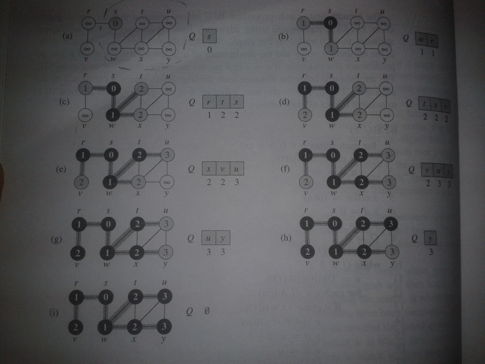

# Breadth First Search

1.Links
--------

+ [MIT Lecture](http://ocw.mit.edu/courses/electrical-engineering-and-computer-science/6-006-introduction-to-algorithms-fall-2011/lecture-videos/lecture-13-breadth-first-search-bfs/)

+ [Typed Notes](MIT6_006F11_lec13.pdf)

+ [Handwritten Notes](MIT6_006F11_lec13_orig.pdf)

+ Cormen, pg 590
	
2.Psuedo Code
--------

### 2.1 Adjacency List  
To represent the graph there is an array of vertices present in the graph and each of it contains a link to list of vertices that are connected to the given vertex.

### 2.2 Terms Used

+ p, parent(predecessor of vertex)
+ color : white for undiscovered nodes, grey and black for discovered. (grey=children not discovered,else black)
+ d, distance from starting node
+ s,starting node
+ Q, a FIFO Queue

```  
BFS(G,s)
for each vertex u belonging to graph G
	u.color = white
	u.distance = infinity
	u.parent=null

s.color = gray
s.distance=0
s.parent = null
Q=null
Q.add(S)
while(Q is not empty)
	u = Q.dequeue();
	for each vertex v beloging to adjacent list of u
		if v.color == white, i.e. it is undiscovered
			v.color=gray 
			v.d=u.d+1
			v.p=u
			Q.add(v)
	u.color = black
```

3.Java Code
-----

[Link](BFS.java)


```Java
import java.util.*;

class Node
{
	Vertex v;
	Node next; //next in linked list

	Node(Vertex x)
	{
		v=x;
	}
}

class LList
{
	Node head,current;

	void add(Vertex x)
	{
		if(head==null)
		{
			head=new Node(x);
			current=head;
		}
		else
		{
			Node newNode = new Node(x);
			current.next = newNode;
			current=newNode;
		}
	}

	void display()
	{
		System.out.print("[ ");
		for(Node i = head;i!=null;i=i.next)
		{
			System.out.print(i.v.vertexName+" ");
		}
		System.out.println("]");
	}
}

class Vertex
{
	char vertexName;
	Vertex parent;
	int distance;
	String color;

	LList neighbors=new LList();

	Vertex(char x)
	{
		vertexName=x;
	}
}

class Graph
{
	int nVertices;
	Vertex vertexList[];

	void inputData()
	{
		//nVertices=4;
		nVertices=6;
		vertexList=new Vertex[nVertices];

		vertexList[0]=new Vertex('s');
		vertexList[1]=new Vertex('w');
		vertexList[2]=new Vertex('t');
		vertexList[3]=new Vertex('x');
		
		vertexList[4]=new Vertex('u');
		vertexList[5]=new Vertex('y');

		vertexList[0].neighbors.add(vertexList[1]);
		vertexList[1].neighbors.add(vertexList[2]);
		vertexList[1].neighbors.add(vertexList[3]);
		vertexList[2].neighbors.add(vertexList[1]);
		vertexList[2].neighbors.add(vertexList[3]);
		vertexList[3].neighbors.add(vertexList[1]);
		vertexList[3].neighbors.add(vertexList[2]);

	//	tu,xu,xy,ut,ux,uy,yx,yu

		vertexList[2].neighbors.add(vertexList[4]);
		vertexList[3].neighbors.add(vertexList[4]);
		vertexList[3].neighbors.add(vertexList[5]);
		vertexList[4].neighbors.add(vertexList[2]);
		vertexList[4].neighbors.add(vertexList[3]);
		vertexList[4].neighbors.add(vertexList[5]);
		vertexList[5].neighbors.add(vertexList[3]);
		vertexList[5].neighbors.add(vertexList[4]);
	}

	void display()
	{
		System.out.println("Adjacency Lists:-");
		for(int i=0;i<vertexList.length;i++)
		{
			vertexList[i].neighbors.display();
		}
	}

	void BFS()
	{
		int infinity=10000; //infinity value
		Queue<Vertex> Q =new LinkedList<Vertex>();

		for(int i=1;i<vertexList.length;i++) 
		{
			vertexList[i].color="white";
			vertexList[i].distance=infinity;
			vertexList[i].parent=null; //optional, by default null
		}

		vertexList[0].color="gray";
		vertexList[0].distance=0;
		vertexList[0].parent=null; //optional

		Q.add(vertexList[0]);
		//System.out.println(Q.isEmpty());
		while(!Q.isEmpty())
		{
			Vertex u = Q.poll(); //retrieve and remove first element

			for(Node i=u.neighbors.head;i!=null;i=i.next)
			{
				if(i.v.color=="white")
				{
					i.v.color="gray";
					i.v.distance=u.distance+1;
					i.v.parent=u;
					Q.add(i.v);
				}
			}
			u.color="black";
		}
	}

	void displayDistances()
	{
		for(int i=0;i<vertexList.length;i++)
		{
			System.out.println(vertexList[i].vertexName+" : "+vertexList[i].distance);
		}
	}

	void displayShortestPath(Vertex V) //displays shortest path to parent
	{
		System.out.print(V.vertexName+"-->");
		Vertex i;
		for(i = V.parent; i.parent!=null;i=i.parent)
		{
			System.out.print(i.vertexName+"-->");
		}
		System.out.println(i.vertexName+" : "+V.distance);
	}

	void displayAllShortestPaths()
	{
		System.out.println("\nShortest Paths :-");
		for(int i=1;i<vertexList.length;i++)
		{
			displayShortestPath(vertexList[i]);
		}
	}
}

class BFS
{
	public static void main(String args[])
	{
		Graph G = new Graph();
		G.inputData();
		G.display();
		G.BFS();
		//G.displayDistances();
		G.displayAllShortestPaths();
	}
}

```

Output:-
```
Adjacency Lists:-
[ w ]
[ t x ]
[ w x u ]
[ w t u y ]
[ t x y ]
[ x u ]

Shortest Paths :-
w-->s : 1
t-->w-->s : 2
x-->w-->s : 2
u-->t-->w-->s : 3
y-->x-->w-->s : 3
```
