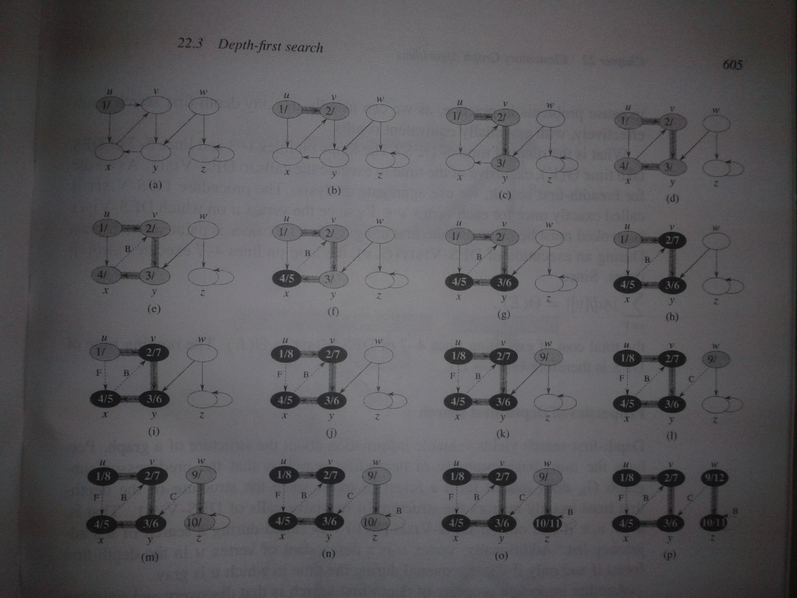

# Depth First Search

1.Links
------

+ [MIT Lecture](http://ocw.mit.edu/courses/electrical-engineering-and-computer-science/6-006-introduction-to-algorithms-fall-2011/lecture-videos/lecture-14-depth-first-search-dfs-topological-sort/#vid_related)
+ [MIT Handwritten Notes](http://ocw.mit.edu/courses/electrical-engineering-and-computer-science/6-006-introduction-to-algorithms-fall-2011/lecture-videos/MIT6_006F11_lec14_orig.pdf)
+ [MIT Typed Notes](http://ocw.mit.edu/courses/electrical-engineering-and-computer-science/6-006-introduction-to-algorithms-fall-2011/lecture-videos/MIT6_006F11_lec14.pdf)

2.Psuedo Code
--------

+ DFSin : Time when DFS procedure enters vertex.
+ DFSout : Time when DFS procedure leaves vertex.

DFS(G)   

```
for each vertex u in G
	u.color=white
	u.parent=null
time=0

for each vertex u in G
	if(u.color==white)
		DFSVisit(G,u)
```

DFSVisit(G)   

```
time = time+1
u.DFSin = time
u.color = gray
for each verte v in adjacency list of u
	if(v.color==white)
		v.parent=u
		DFSVisit(G,v)
u.color=black
time = time+1
u.DFSout=time
```

3.Java Code
--------

[Link](https://github.com/sjs7007/Learn/blob/master/Algos/DepthFirstSearch/DFS.java)   
   


```Java

import java.util.*;

class Node
{
	Vertex v;
	Node next; //next in linked list

	Node(Vertex x)
	{
		v=x;
	}
}

class LList
{
	Node head,current;

	void add(Vertex x)
	{
		if(head==null)
		{
			head=new Node(x);
			current=head;
		}
		else
		{
			Node newNode = new Node(x);
			current.next = newNode;
			current=newNode;
		}
	}

	void display()
	{
		System.out.print("[ ");
		for(Node i = head;i!=null;i=i.next)
		{
			System.out.print(i.v.vertexName+" ");
		}
		System.out.println("]");
	}
}

class Vertex
{
	char vertexName;
	Vertex parent;
	String color;
	int DFSin; //timestamp when DFS enters vertex
	int DFSout; //timestamp when DFS leaves vertex

	LList neighbors=new LList();

	Vertex(char x)
	{
		vertexName=x;
	}
}

class Graph
{
	int nVertices;
	Vertex vertexList[];
	int time;

	void inputData()
	{
		//nVertices=4;
		nVertices=6;
		vertexList=new Vertex[nVertices];

		vertexList[0]=new Vertex('u');
		vertexList[1]=new Vertex('x');
		vertexList[2]=new Vertex('v');
		vertexList[3]=new Vertex('y');
		vertexList[4]=new Vertex('w');
		vertexList[5]=new Vertex('z');

		vertexList[0].neighbors.add(vertexList[2]);
		vertexList[0].neighbors.add(vertexList[1]);
		vertexList[1].neighbors.add(vertexList[2]);
		vertexList[2].neighbors.add(vertexList[3]);
		vertexList[3].neighbors.add(vertexList[1]);
		vertexList[4].neighbors.add(vertexList[3]);
		vertexList[4].neighbors.add(vertexList[5]);
		vertexList[5].neighbors.add(vertexList[5]);
	}

	void display()
	{
		System.out.println("Adjacency Lists:-");
		for(int i=0;i<vertexList.length;i++)
		{
			System.out.print(vertexList[i].vertexName+" : ");
			vertexList[i].neighbors.display();
		}
	}

	void DFS()
	{
		for(int i=0;i<vertexList.length;i++) 
		{
			vertexList[i].color="white";
			vertexList[i].parent=null; //optional, by default null
		}
		time=0;

		for(int i=0;i<vertexList.length;i++)
		{
			if(vertexList[i].color=="white")
			{
				DFSVisit(vertexList[i]);
			}			
		}		
	}

	void DFSVisit(Vertex u)
	{
		time = time + 1;
		u.DFSin = time;
		u.color = "gray";
		for(Node i=u.neighbors.head;i!=null;i=i.next)
		{
			if(i.v.color=="white")
			{
				i.v.parent = u;
				DFSVisit(i.v);
			}
		}
		u.color="black";
		time = time + 1;
		u.DFSout = time;
	}

	void displayTimes()
	{
		System.out.println("Times :-");
		for(int i=0;i<vertexList.length;i++)
		{
			System.out.println(vertexList[i].vertexName+" : "+vertexList[i].DFSin+","+vertexList[i].DFSout);
		}
	}
}

class DFS
{
	public static void main(String args[])
	{
		Graph G = new Graph();
		G.inputData();
		G.display();
		G.DFS();
		G.displayTimes();
	}
}

```

Output:-   

```  
Adjacency Lists:-   

u : [ v x ]
x : [ v ]
v : [ y ]
y : [ x ]
w : [ y z ]
z : [ z ]

Times :-   

u : 1,8
x : 4,5
v : 2,7
y : 3,6
w : 9,12
z : 10,11
```
