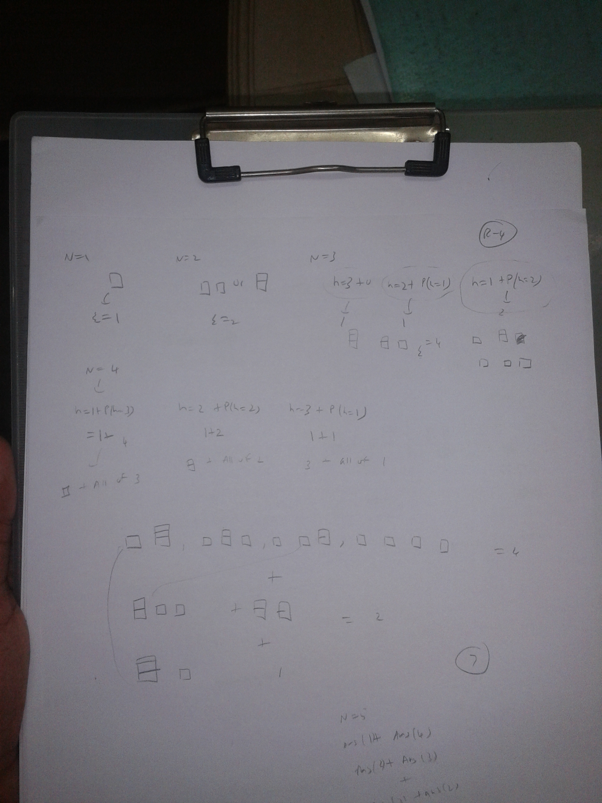

# Dynamic Programming

1.Links
------

+ Lecture 1
	
	+ [Fibonacci, Shortest Paths](http://ocw.mit.edu/courses/electrical-engineering-and-computer-science/6-006-introduction-to-algorithms-fall-2011/lecture-videos/lecture-19-dynamic-programming-i-fibonacci-shortest-paths/)

	+ [Typed Notes](http://ocw.mit.edu/courses/electrical-engineering-and-computer-science/6-006-introduction-to-algorithms-fall-2011/lecture-videos/MIT6_006F11_lec19.pdf)
	
	+ [Handwritten Notes](http://ocw.mit.edu/courses/electrical-engineering-and-computer-science/6-006-introduction-to-algorithms-fall-2011/lecture-videos/MIT6_006F11_lec19_orig.pdf)

+ Lecture 2

	+ [Text Justification, Blackjack](http://ocw.mit.edu/courses/electrical-engineering-and-computer-science/6-006-introduction-to-algorithms-fall-2011/lecture-videos/lecture-20-dynamic-programming-ii-text-justification-blackjack/)

	+ [Typed Notes](http://ocw.mit.edu/courses/electrical-engineering-and-computer-science/6-006-introduction-to-algorithms-fall-2011/lecture-videos/MIT6_006F11_lec20.pdf)

	+ [Handwritten Notes](http://ocw.mit.edu/courses/electrical-engineering-and-computer-science/6-006-introduction-to-algorithms-fall-2011/lecture-videos/MIT6_006F11_lec20_orig.pdf)

+ Cormen, pg 359

2.General Structure
-------

+ Characterize the structure of an optimal solution.

+ Recursively define the value of an optimal solution.

+ Compute the value of an optimal solution, typically in a bottom-up fashion.

+ Construct an optimal solution from computed information.

3.Problems
-------

### 3.1 Rod Cutting Problem

+ Naive Recursive Solution

	**Cut-Rod(p,n)**   
	```
	if(n==0)
		return 0
	q=-1
	for i=1 to n
		q=max(q,p[i]+Cut-Rod(p,n-i))
	return q
	```

+ Memoized Version

	Store intermediate results in array.   

	**Memoized-Cut-Rod(p,n,r)**
	```
	if(r[n]>=0)
		return r[n]
	if(n==0)
		q=0
	else q=-1
		for i=1 to n
			q=max(q,p[i]+Memoized-Cut-Rod(p,n-i,r))
	r[n]=q
	return q
			q
	```

+ Bottom up version.

	Solve subproblems in topological order.   

	**Bottom-Up-Cut-Rod(p,n)**
	```
	r[0..n] array of profits
	r[0]=0
	for j=1 to n
		q=-1
		for i=1 to j
			q=max(q,p[i]+r[j-i])
			r[j]=q
	return r[n]
	```

+ Java Codes : [Recusive Solution](https://github.com/sjs7007/Learn/tree/master/Algos/DynamicProgramming/RodCutting1.java), [Memoized Solution](https://github.com/sjs7007/Learn/tree/master/Algos/DynamicProgramming/RodCutting2.java), [Bottom Up Solution](https://github.com/sjs7007/Learn/tree/master/Algos/DynamicProgramming/RodCutting3.java)

### 3.2 Mario - Problem on Hacker Earth

+ [Link](http://www.hackerearth.com/problem/algorithm/roy-and-little-mario-4/)

+ Solution 

	+ ans(1)=1,ans(2)=2,ans(3)=4

	+ ans(n>3) = keep 1 block separate and ans(n-1) + keep 2 blocks separate and ans(n-2) + keep 3 blocks separate and ans(n-3)

	

+ [Java Code Link using Bottom Up Approach](https://github.com/sjs7007/Learn/tree/master/Algos/DynamicProgramming/he43.java)