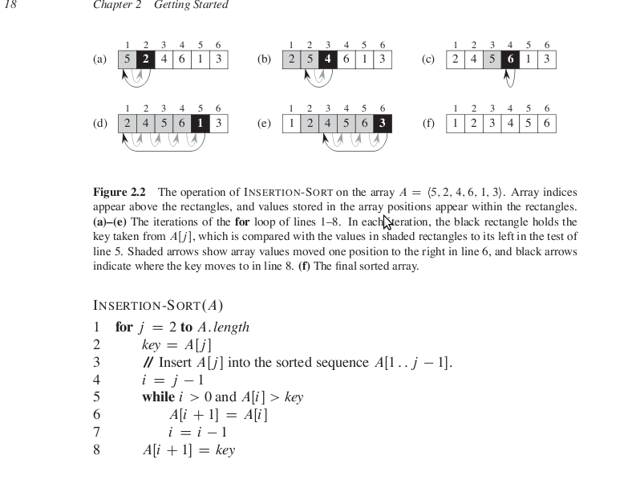

# Insertion Sort

1.Links
-----

+ Cormen, pg 16

2.Psuedo Code & Example
------



3.Java Code
-----

[Java Code](https://github.com/sjs7007/Learn/blob/master/Algos/InsertionSort/InsertionSort.java)

```Java
class InsertionSort
{
	public static void main(String args[])
	{
		int numbers[]={4,1,3,7,8,2,5,6};
		int n=numbers.length;
		for(int i=1;i<n;i++)
		{
			int key = numbers[i];
			int j=i-1;
			while(j>=0 && key<=numbers[j])
			{
				numbers[j+1]=numbers[j];
				j--;
			}
			numbers[j+1]=key;
			System.out.print("After iteration "+i+" : ");
			for(j=0;j<n;j++)
			{
				System.out.print(numbers[j]+" ");
			}
			System.out.println();
		}
		for(int i=0;i<n;i++)
		{
			System.out.print(numbers[i]+" ");
		}
	}
}
```

Output:-  

```
After iteration 1 : 1 4 3 7 8 2 5 6    
After iteration 2 : 1 3 4 7 8 2 5 6    
After iteration 3 : 1 3 4 7 8 2 5 6    
After iteration 4 : 1 3 4 7 8 2 5 6    
After iteration 5 : 1 2 3 4 7 8 5 6    
After iteration 6 : 1 2 3 4 5 7 8 6    
After iteration 7 : 1 2 3 4 5 6 7 8    
1 2 3 4 5 6 7 8
```