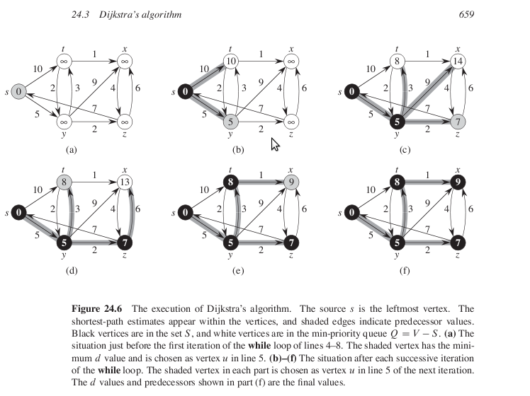
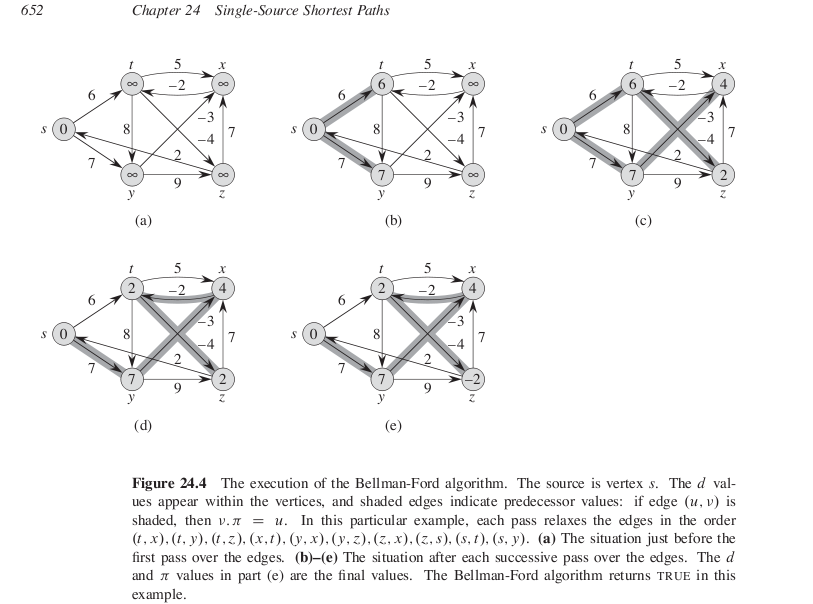

# Single Source Shortest Paths

1.Links
-----

+ Lecture 1  

	+ [Introduction](http://ocw.mit.edu/courses/electrical-engineering-and-computer-science/6-006-introduction-to-algorithms-fall-2011/lecture-videos/lecture-15-single-source-shortest-paths-problem/)

	+ [Slides](http://ocw.mit.edu/courses/electrical-engineering-and-computer-science/6-006-introduction-to-algorithms-fall-2011/lecture-videos/MIT6_006F11_lec15.pdf)

	+ Cormen, pg 643

+ Lecture 2   

	+ [Dijkstra's Algo](http://ocw.mit.edu/courses/electrical-engineering-and-computer-science/6-006-introduction-to-algorithms-fall-2011/lecture-videos/lecture-16-dijkstra/)

	+ [Slides](http://ocw.mit.edu/courses/electrical-engineering-and-computer-science/6-006-introduction-to-algorithms-fall-2011/lecture-videos/MIT6_006F11_lec16.pdf)

	+ Cormen, pg 658

+ Lecture 3

	+ [Bellman Ford Algo](http://ocw.mit.edu/courses/electrical-engineering-and-computer-science/6-006-introduction-to-algorithms-fall-2011/lecture-videos/lecture-17-bellman-ford/)

	+ [Slides](http://ocw.mit.edu/courses/electrical-engineering-and-computer-science/6-006-introduction-to-algorithms-fall-2011/lecture-videos/MIT6_006F11_lec17.pdf)

	+ Cormen, pg 651

+ Lecture 4

	+ [Speeding up Dijkstra](http://ocw.mit.edu/courses/electrical-engineering-and-computer-science/6-006-introduction-to-algorithms-fall-2011/lecture-videos/lecture-18-speeding-up-dijkstra/)

	+ [Slides](http://ocw.mit.edu/courses/electrical-engineering-and-computer-science/6-006-introduction-to-algorithms-fall-2011/lecture-videos/MIT6_006F11_lec18.pdf)

2.Common Psuedo Codes
-----

### 2.1 Initialize-Single-Source(G,s)   

```
for each vertex v belonging to G
	v.d = infinity
	v.parent = null
s.d = 0
```

### 2.2 Relax(u,v,w)   

```
if(v.d > u.d + w(u,v))
	v.d = u.d + w(u,v)
	v.parent = u
```

3.Dijkstra 
-----

### 3.1 Description

+ Solves single source shortest path on a weighted directed graph G.
+ Here all edge weights are >=0.

### 3.2 Example   



### 3.3 Psuedo Code   

+ Q is a min. priority arranged by key values as vertex distances from start node.

Dijkstra(G,w,s)   

```
Initialize-Single-Source(G,s)
Add all vertices in G to Q
while(Q is not empty)
	u=Extract-Min(Q) 
	for each vertex v in adjacency list of u
		Relax(u,v,w)
```

### 3.4 Java Code

[Java Code Link]()

```Java
//Dijkstra implementation using Min. Heap as Min. PQ

class Node
{
	Vertex v;
	Node next; //next in linked list
	int weight; //store weight of edge

	Node(Vertex x,int w)
	{
		v=x;
		weight=w;
	}
}

class LList
{
	Node head,current;

	void add(Vertex x,int w)
	{
		if(head==null)
		{
			head=new Node(x,w);
			current=head;
		}
		else
		{
			Node newNode = new Node(x,w);
			current.next = newNode;
			current=newNode;
		}
	}

	void display()
	{
		System.out.print("[ ");
		for(Node i = head;i!=null;i=i.next)
		{
			System.out.print(i.v.vertexName+"("+i.weight+") ");
		}
		System.out.println("]");
	}
}

class Vertex
{
	char vertexName;
	Vertex parent;
	int d;

	LList neighbors=new LList();

	Vertex(char x)
	{
		vertexName=x;
	}
}

class PQ //min. priority queue
{
	Vertex data[];
	int heapSize,n;
	int infinity = 10000;

	PQ(int x)
	{
		n=x;
		data=new Vertex[n];
	}

	void MinHeapify(int i)
	{
		int l,r;
		l=2*i+1; // NOTE +1 because array starst with 0
		r=l+1;
		int smallest=i;
		if(l<heapSize && data[l].d<data[i].d)
		{
			smallest=l;
		}
		if(r<heapSize && data[r].d<data[smallest].d)
		{
			smallest=r;
		}
		if(smallest!=i)
		{	
		//	System.out.println("Swapping "+data[i]+" and "+data[smallest]+". "+smallest);
			Vertex temp=data[i];
			data[i]=data[smallest];
			data[smallest]=temp;	
			MinHeapify(smallest);
		}
	}

	Vertex ExtractMin()
	{
		if(heapSize<1)
		{
			return null; //heap underflow
		}
		Vertex min=data[0];
		data[0]=data[heapSize-1];
		heapSize--;
		MinHeapify(0);
		return min;
	}

	void DecreaseKey(int i,int key)
	{
		if(key>data[i].d)
		{
			System.out.println("New key is smaller than current key.");
		}
		data[i].d=key;
		while(i>0 && data[i/2].d>data[i].d)
		{
			Vertex temp=data[i];
			data[i]=data[i/2];
			data[i/2]=temp;
			i=i/2;
		}
	}

	void Insert(Vertex V)
	{
		heapSize++;
		int key=V.d;
		V.d = infinity;
		data[heapSize-1]=V;
		DecreaseKey(heapSize-1,key);
	}

	boolean isEmpty()
	{
		return heapSize==0;
	}
}

class Graph
{
	int nVertices;
	Vertex vertexList[];
	int time;

	void inputData()
	{
		//nVertices=4;
		nVertices=5;
		vertexList=new Vertex[nVertices];

		vertexList[0]=new Vertex('s');
		vertexList[1]=new Vertex('t');
		vertexList[2]=new Vertex('y');
		vertexList[3]=new Vertex('x');
		vertexList[4]=new Vertex('z');
	
		vertexList[0].neighbors.add(vertexList[1],10);
		vertexList[0].neighbors.add(vertexList[2],5);
		vertexList[1].neighbors.add(vertexList[3],1);
		vertexList[1].neighbors.add(vertexList[2],2);
		vertexList[2].neighbors.add(vertexList[1],3);
		vertexList[2].neighbors.add(vertexList[3],9);
		vertexList[2].neighbors.add(vertexList[4],2);
		vertexList[3].neighbors.add(vertexList[4],4);
		vertexList[4].neighbors.add(vertexList[0],7);
		vertexList[4].neighbors.add(vertexList[3],6);
	}

	void display()
	{
		System.out.println("Adjacency Lists:-");
		for(int i=0;i<vertexList.length;i++)
		{
			System.out.print(vertexList[i].vertexName+" : ");
			vertexList[i].neighbors.display();
		}
	}

	void initializeSS()
	{
		int infinity=10000;
		for(int i=1;i<vertexList.length;i++)
		{
			vertexList[i].d=infinity;
			vertexList[i].parent=null; //optional
		}
		vertexList[0].d=0; //optional
	}

	void relax(Vertex u,Vertex v,int weightUV)
	{
		if(v.d>u.d+weightUV)
		{
			v.d = u.d + weightUV;
			v.parent = u;
		}
	}

	void dijkstra()
	{
		initializeSS();
		PQ Q = new PQ(nVertices);
		
		for(int i=0;i<nVertices;i++)
		{
			Q.Insert(vertexList[i]);
		}

		//System.out.println(Q.ExtractMin().d);
		while(!Q.isEmpty())
		{
			Vertex u = Q.ExtractMin();
			for(Node i=u.neighbors.head;i!=null;i=i.next)
			{
				relax(u,i.v,i.weight);
			}
		}
	}

	void displayDijkstraDistances()
	{
		System.out.println("\nDijkstra Distances :-");
		for(int i=0;i<nVertices;i++)
		{
			System.out.println(vertexList[i].vertexName+" : "+vertexList[i].d);
		}
	}
}


class Dijkstra
{
	public static void main(String args[])
	{
		Graph G = new Graph();
		G.inputData();
		G.display();
		G.dijkstra();
		G.displayDijkstraDistances();
	}
}
```

Output :-

```
Adjacency Lists:-  

s : [ t(10) y(5) ]
t : [ x(1) y(2) ]
y : [ t(3) x(9) z(2) ]
x : [ z(4) ]
z : [ s(7) x(6) ]

Dijkstra Distances :-  

s : 0
t : 8
y : 5
x : 9
z : 7

```

4.Bellman Ford Algorithm
-------

### 4.1 Description

+ Solves single source shortest path problem in general case in which edge weights maybe negative.
+ Returns a boolean value indicating whether or not there is a negative-weight cycle that is reachable from source.
+ If there is such a cycle, no solution exists.
+ Runs in O(VE) time.

### 4.2 Example



### 4.3 Psuedo Code

Bellman-Ford(G,w,s)
```
Initialize-Single-Source(G,s)
for i=0 to nVertices-1
	for each edge (u,v) belonging to graph G
		Relax(u,v,w)
for each ege (u,v) belonging to graph G
	if v.d > u.d + w(u,v)
		return FALSE
return TRUE
```
### 4.4 Java Code

[Java Code](BellmanFord.java)

```Java
class Node
{
	Vertex v;
	Node next; //next in linked list
	int weight; //store weight of edge

	Node(Vertex x,int w)
	{
		v=x;
		weight=w;
	}
}

class LList
{
	Node head,current;

	void add(Vertex x,int w)
	{
		if(head==null)
		{
			head=new Node(x,w);
			current=head;
		}
		else
		{
			Node newNode = new Node(x,w);
			current.next = newNode;
			current=newNode;
		}
	}

	void display()
	{
		System.out.print("[ ");
		for(Node i = head;i!=null;i=i.next)
		{
			System.out.print(i.v.vertexName+"("+i.weight+") ");
		}
		System.out.println("]");
	}
}

class Vertex
{
	char vertexName;
	Vertex parent;
	int d;

	LList neighbors=new LList();

	Vertex(char x)
	{
		vertexName=x;
	}
}


class Graph
{
	int nVertices;
	Vertex vertexList[];
	int time;

	void inputData()
	{
		//nVertices=4;
		nVertices=5;
		vertexList=new Vertex[nVertices];

		vertexList[0]=new Vertex('s');
		vertexList[1]=new Vertex('t');
		vertexList[2]=new Vertex('y');
		vertexList[3]=new Vertex('x');
		vertexList[4]=new Vertex('z');
	
		vertexList[0].neighbors.add(vertexList[1],10);
		vertexList[0].neighbors.add(vertexList[2],5);
		vertexList[1].neighbors.add(vertexList[3],1);
		vertexList[1].neighbors.add(vertexList[2],2);
		vertexList[2].neighbors.add(vertexList[1],3);
		vertexList[2].neighbors.add(vertexList[3],9);
		vertexList[2].neighbors.add(vertexList[4],2);
		vertexList[3].neighbors.add(vertexList[4],4);
		vertexList[4].neighbors.add(vertexList[0],7);
		vertexList[4].neighbors.add(vertexList[3],6);
	}

	void display()
	{
		System.out.println("Adjacency Lists:-");
		for(int i=0;i<vertexList.length;i++)
		{
			System.out.print(vertexList[i].vertexName+" : ");
			vertexList[i].neighbors.display();
		}
	}

	void initializeSS()
	{
		int infinity=10000;
		for(int i=1;i<vertexList.length;i++)
		{
			vertexList[i].d=infinity;
			vertexList[i].parent=null; //optional
		}
		vertexList[0].d=0; //optional
	}

	void relax(Vertex u,Vertex v,int weightUV)
	{
		if(v.d>u.d+weightUV)
		{
			v.d = u.d + weightUV;
			v.parent = u;
		}
	}

	boolean bellmanFord()
	{
		initializeSS();

		for(int i=1;i<=nVertices-1;i++)
		{
			for(int j=0;j<nVertices;j++)
			{
				for(Node k=vertexList[j].neighbors.head;k!=null;k=k.next)
				{
					relax(vertexList[j],k.v,k.weight);
				}
			}
		}

		for(int j=0;j<nVertices;j++)
		{
			for(Node i=vertexList[j].neighbors.head;i!=null;i=i.next)
			{
				if(i.v.d > vertexList[j].d + i.weight)
				{
					System.out.println("Negative weight cycle present in graph.");
					return false;
				}
			}
		}

		return true;
	}

	void displayBellmanFordDistances()
	{
		System.out.println("\nBellmanFord Distances :-");
		for(int i=0;i<nVertices;i++)
		{
			System.out.println(vertexList[i].vertexName+" : "+vertexList[i].d);
		}
	}
}


class BellmanFord
{
	public static void main(String args[])
	{
		Graph G = new Graph();
		G.inputData();
		G.display();
		G.bellmanFord();
		G.displayBellmanFordDistances();
	}
}

```

Output :-

```
Adjacency Lists:-  

s : [ t(10) y(5) ]
t : [ x(1) y(2) ]
y : [ t(3) x(9) z(2) ]
x : [ z(4) ]
z : [ s(7) x(6) ]

BellmanFord Distances :-  

s : 0
t : 8
y : 5
x : 9
z : 7

```


