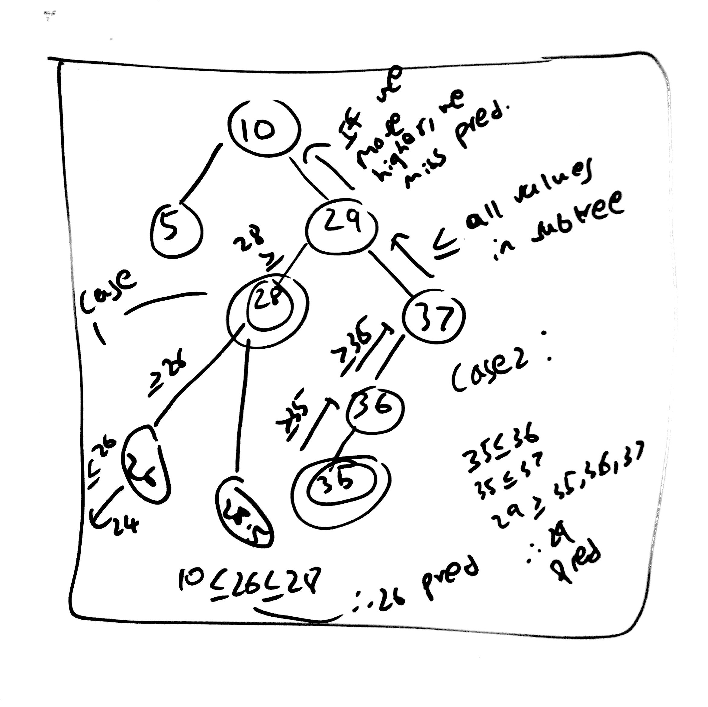
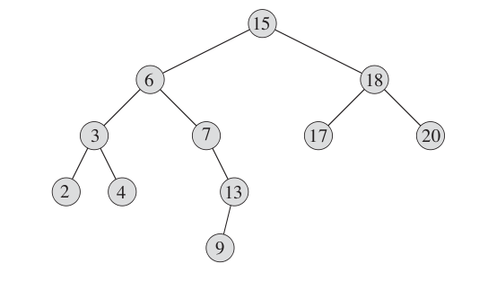

 Binary Search Tree

1.Links
-------

+ [MIT Lecture](http://ocw.mit.edu/courses/electrical-engineering-and-computer-science/6-006-introduction-to-algorithms-fall-2011/lecture-videos/lecture-5-binary-search-trees-bst-sort/)
+ [MIT Recitation](http://ocw.mit.edu/courses/electrical-engineering-and-computer-science/6-006-introduction-to-algorithms-fall-2011/recitation-videos/recitation-5-recursion-trees-binary-search-trees)
+ [MIT Lecture Notes](http://ocw.mit.edu/courses/electrical-engineering-and-computer-science/6-006-introduction-to-algorithms-fall-2011/lecture-videos/MIT6_006F11_lec05.pdf)
+ Cormen, pg 286

2.Notes
------

+ **Binary Search Tree Property** : If x is a node in a BST and y is in left subtree of x, then y.key<=x.key. Similarly if y is in right subtree of x, then y.key>=x.key
+ Insertion in tree of height h takes order O(h) time. 
+ h can range from lgn to n-1. 

## 2.1 Minimum 
+ Keep following left child pointers till the next left child pointer is null. Current node is min.

## 2.2 Max
+ Similar as above, keep following right child....

## 2.3 Predecessor 
+ **Case 1** : Node x has left subtree. 
By BST property, left subtree will only have elements <=x. The max of this subtree is the one closest to x. Lets call it left.

However there can be nodes higher up with values <=x. But if that node has value <=x, it implies that node will have value <= all elements present in left subtree of x. Lets call that higher node h.

Hence, we will have h <= left && h<= x, also left <= x. 

Hence, h <= left <= x which implies left will be the predecessor of x. 

Therefore, max of left subtree will be predecessor in this case.

+ **Case 2** : Node x doesnt have left subtree.
In that case the only possible elements with value <=x will lie above x and be an ancestor of x. x has to be a right descendant of predecessor, to satisfy x>=predecessor or predecessor<=x. The lowest node in the tree which has x has right descendant will be the predecessor because if we go higher we miss the predecessor. 



## 2.4 Successor
+ **Case 1 :** Node x has right subtree.
By BST property, right subtree will only have elments >=x. The min of this subtree is the one closes to x. Lets call it right.

However there can be nodes higher up with values >=x. But if that node has value >=x, it implies that node will have value >= all elements present in the right subtree of x as well. Lets call that higher node h. 

Hence, we will have h>= right and x. Also right >=x.

Hence, h >= right >=x which implies right will be the sucessor of x.

Therefore, min of right subtree will be predecessor in this case.

+ **Case 2 :** Node x has no right subtree.
In that case the only possible elements with value >=x will lie above x and be an ancestor of x. x has to be a left descendant of successor to satisfy x<= successor or successor >=x. The lowest node in the tree which has x has left descendant will be the successor because if we go higher we miss the successor. 
3.Psuedo code
------

+ Inorder-Tree-Walk(x)   

	```
	if(x!=null)
		Inorder-Tree-Walk(x.left)
		print x.key
		Inorder-Tree-Walk(x.right)
	```

	+ Prints the keys of BST in sorted order.

	+ Similary preorder walk(VLR) and postorder walk(LRV).

+ Recursive-Tree-Search(x,k)   

	+ x = pointer to root of tree
	+ k = key value being searched
	
	```
	if(x==null || x.key==k)
		return x
	if(k<x.key)
		return Recursive-Tree-Search(x.left,k)
	else return Recursive-Tree-Search(x.right,k)
	```

+ Iterative-Tree-Search(x,k)  

	```
	while(x!=null and k!=x.key)
		if(k<x.key)
			x=x.left
		else x=x.right
	return x
	```
+ min : keep going left till left!=null

+ max : keep going right till right!=null

+ Successor 

		

	+ Case 1 : If there is right subtree then the min value in right subtree will be succ. Succ(15)--Min(18)=17
			

	+ Case 2 : If there is no right subtree, the succ will be the lowest ancestor of x whose left child is also an ancestor of x.
				Succ(13)--->7---->6--->15

	```
	if(x.right!=null)
		return min(x.right)
	y = x.p
	while(y!=null and x==y.right) //will continue till x is left child of y
		x=y 
		y=y.p
	return y
	```

+ Predecessor

	

	+ Case 1 : If there is left subtree then the max value in left subtree will be pred. Pred(6)--max(3)=4

	+ Case 2 : If there is no left subtree, then the pred will be lowest ancestor of x whose right child is also an ancestor of x.
				Pred(9)--->13--->7

	```
	if(x.left!=null)
		return max(x.left)
	y=x.p
	while(y!=null and x==y.left) 
		=y
		y=y.p
	return y
	```


