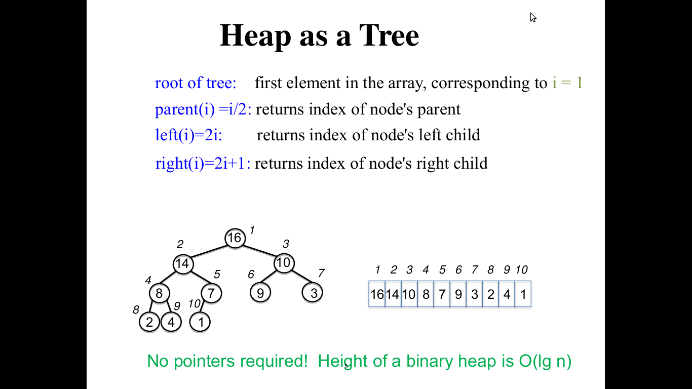

# Heap 

1.Links
----
+ [MIT Video](http://ocw.mit.edu/courses/electrical-engineering-and-computer-science/6-006-introduction-to-algorithms-fall-2011/lecture-videos/lecture-4-heaps-and-heap-sort/)
+ [MIT Slides](http://ocw.mit.edu/courses/electrical-engineering-and-computer-science/6-006-introduction-to-algorithms-fall-2011/lecture-videos/MIT6_006F11_lec04.pdf)
+ Cormen, pg 151

2.Brief Description
--------


3.Psuedo Codes for Max-Heap(Heap-Sort)
------

### 3.1 Max-Heapify(A,i)

+ Heap size : Although A[1..A.length] may contain numbers, only the elements in A[1...A.heap-size], where 0<=A.heap-size<=A.length are valid elements of the heap.

+ parent(i)=return i/2

+ left(i)=return 2i

+ right(i)=return 2i+1

+ **Assumption** : Left and right children are max heaps but A[i] maybe smaller than its children thus violating max heap property.

+ largest : index of largest value among left,right and parent.

Max-Heapify(A,i)   

```C
l=left(i)=2i // **NOTE**:For array starting from 0 index left=2i+1,right=2i+2 
r=right(i)=2i+1
if(l<=A.heap-size and A[l]>A[i]) //if right child is greater than root,set that index to largest else to parent
	largest=l
else  largest=i
if(r<=A.heap-size and A[r]>A[i]) 
	largest=r

if(largest!=i)
	A[i]<-->A[largest]
	Max-Heapify(A,largest)
```

### 3.2 Build-Max-Heap(A)  

+ All the elements in the subarray A(floor(n/2)+1...n) are all leves of the tree and hence each is a 1-element heap to begin with.

+ Thus the Max-Heapify procedure can be used in a bottom-up manner to convert heap to max-heap.

Build-Max-Heap(A) for 0 based index  

```
A.heap-size=A.length
for i = floor(A.length/2) down-to 0
	Max-Heapify(A,i)
```

### 3.3 Heap-Sort(A) for 0 based index

```
for i = A.length-1 to 1
	A[0]<-->A[i]
	A.heap-size=A.heap-size-1
	Max-Heapify(A,0)
```


4.Java Code
----
[Max Heap](https://github.com/sjs7007/Learn/blob/master/DataStructures/Heap/HeapCodeMax.java)
[Min Heap](https://github.com/sjs7007/Learn/blob/master/DataStructures/Heap/HeapCodeMin.java)

```Java
// Build Max Heap, Heapify, Heap Sort, Extract Max - Max Priority Queue

class Heap
{
	int data[],heapSize;

	Heap(int x[])
	{
		data=x;
		heapSize=x.length;
	}

	void MaxHeapify(int i)
	{
		int l,r;
		l=2*i+1; // NOTE +1 because array starst with 0
		r=l+1;
		int largest=i;
		if(l<heapSize && data[l]>data[i])
		{
			largest=l;
		}
		if(r<heapSize && data[r]>data[largest])
		{
			largest=r;
		}
		if(largest!=i)
		{	
		//	System.out.println("Swapping "+data[i]+" and "+data[largest]+". "+largest);
			int temp=data[i];
			data[i]=data[largest];
			data[largest]=temp;	
			MaxHeapify(largest);
		}
	}

	void BuildMaxHeap()
	{
		heapSize=data.length;
		for(int i=data.length/2;i>=0;i--)
		{
			MaxHeapify(i);
		}
	}

	void HeapSort()
	{
		BuildMaxHeap();
		for(int i=data.length-1;i>=1;i--)
		{
			int temp=data[0];
			data[0]=data[i];
			data[i]=temp;
			heapSize--;
			MaxHeapify(0);
		//	System.out.println(heapSize);
		}
	}
}

class HeapCodeMax
{
	public static void main(String args[])
	{
		int data[]={16,4,10,14,7,9,3,2,8,1};
		Heap H = new Heap(data); 
		//H.MaxHeapify(1);

		H.BuildMaxHeap();
		System.out.print("After bulding max heap : ");
		for(int i=0;i<data.length;i++)
		{
			System.out.print(data[i]+" ");
		}
		System.out.println();
	
		H.HeapSort();
		System.out.print("After heap sort : ");
		for(int i=0;i<data.length;i++)
		{
			System.out.print(data[i]+" ");
		}
		System.out.println();

		
	}
}
```

```Java
// Build Min Heap, Heapify, Heap Sort

class Heap
{
	int data[],heapSize;

	Heap(int x[])
	{
		data=x;
		heapSize=x.length;
	}

	void MinHeapify(int i)
	{
		int l,r;
		l=2*i+1; // NOTE +1 because array starst with 0
		r=l+1;
		int smallest=i;
		if(l<heapSize && data[l]<data[i])
		{
			smallest=l;
		}
		if(r<heapSize && data[r]<data[smallest])
		{
			smallest=r;
		}
		if(smallest!=i)
		{	
		//	System.out.println("Swapping "+data[i]+" and "+data[smallest]+". "+smallest);
			int temp=data[i];
			data[i]=data[smallest];
			data[smallest]=temp;	
			MinHeapify(smallest);
		}
	}

	void BuildMinHeap()
	{
		heapSize=data.length;
		for(int i=data.length/2;i>=0;i--)
		{
			MinHeapify(i);
		}
	}

	void HeapSort()
	{
		BuildMinHeap();
		for(int i=data.length-1;i>=1;i--)
		{
			int temp=data[0];
			data[0]=data[i];
			data[i]=temp;
			heapSize--;
			MinHeapify(0);
		//	System.out.println(heapSize);
		}
	}
}

class HeapCodeMin
{
	public static void main(String args[])
	{
		int data[]={16,4,10,14,7,9,3,2,8,1};
		Heap H = new Heap(data); 
		//H.MinHeapify(1);

		H.BuildMinHeap();
		System.out.print("After bulding min heap : ");
		for(int i=0;i<data.length;i++)
		{
			System.out.print(data[i]+" ");
		}
		System.out.println();
	
		H.HeapSort();
		System.out.print("After heap sort in decreasing order : ");
		for(int i=0;i<data.length;i++)
		{
			System.out.print(data[i]+" ");
		}
		System.out.println();

		
	}
}
```

5.Psuedo Codes for Max. Priority Queue for 0 based index
-------

### 5.1 Heap-Max(A)  

```
return A[0]
```

### 5.2 Extract-Max(A) 

```
if(A.heap-size<1)
	error "Heap Underflow."
max=A[0]
A[1]=A[A.heap-size-1] 
A.heap-size--;
Max-Heapify(A,0)
return max
```

### 5.3 Increase-Key(A,i,key) 

```
if(key<A[i])
	error "new key is smaller than current key."
A[i]=key
while i>0 and A[parent(i)]<A[i]
	A[i]<-->A[parent(i)]
	i=parent(i)
```

### 5.4 Max-Heap-Insert-Key(A,key)   

```
A.heap-size++;
A[A.heap-size-1]=infinity
Increase-Key(A,A.heap-size-1,key)
```

6.Java Code
----

[Max PQ](https://github.com/sjs7007/Learn/blob/master/DataStructures/Heap/HeapMaxPQ.java)
[Min PQ](https://github.com/sjs7007/Learn/blob/master/DataStructures/Heap/HeapMinPQ.java)

```Java
//Heap based Max. priority Queue

class PQ
{
	int data[],heapSize,n;
	int infinity = 10000;

	PQ(int x)
	{
		n=x;
		data=new int[n];
	}

	void MaxHeapify(int i)
	{
		int l,r;
		l=2*i+1; // NOTE +1 because array starst with 0
		r=l+1;
		int largest=i;
		if(l<heapSize && data[l]>data[i])
		{
			largest=l;
		}
		if(r<heapSize && data[r]>data[largest])
		{
			largest=r;
		}
		if(largest!=i)
		{	
		//	System.out.println("Swapping "+data[i]+" and "+data[largest]+". "+largest);
			int temp=data[i];
			data[i]=data[largest];
			data[largest]=temp;	
			MaxHeapify(largest);
		}
	}

	int ExtractMax()
	{
		if(heapSize<1)
		{
			return -1; //heap underflow
		}
		int max=data[0];
		data[0]=data[heapSize-1];
		heapSize--;
		MaxHeapify(0);
		return max;
	}

	void IncreaseKey(int i,int key)
	{
		if(key<data[i])
		{
			System.out.println("New key is smaller than current key.");
		}
		data[i]=key;
		while(i>0 && data[i/2]<data[i])
		{
			int temp=data[i];
			data[i]=data[i/2];
			data[i/2]=temp;
			i=i/2;
		}
	}

	void Insert(int key)
	{
		heapSize++;
		data[heapSize-1]=-infinity;
		IncreaseKey(heapSize-1,key);
	}
}

class HeapMaxPQ
{
	public static void main(String args[])
	{
		PQ P = new PQ(10);
		P.Insert(1);
		P.Insert(2);
		P.Insert(500);
		P.Insert(3);
		P.Insert(4);
		System.out.println("Max :"+P.ExtractMax());
		
	}
}

```

```Java
//Heap based Min. priority Queue

class PQ
{
	int data[],heapSize,n;
	int infinity = 10000;

	PQ(int x)
	{
		n=x;
		data=new int[n];
	}

	void MinHeapify(int i)
	{
		int l,r;
		l=2*i+1; // NOTE +1 because array starst with 0
		r=l+1;
		int smallest=i;
		if(l<heapSize && data[l]<data[i])
		{
			smallest=l;
		}
		if(r<heapSize && data[r]<data[smallest])
		{
			smallest=r;
		}
		if(smallest!=i)
		{	
		//	System.out.println("Swapping "+data[i]+" and "+data[smallest]+". "+smallest);
			int temp=data[i];
			data[i]=data[smallest];
			data[smallest]=temp;	
			MinHeapify(smallest);
		}
	}

	int ExtractMin()
	{
		if(heapSize<1)
		{
			return -1; //heap underflow
		}
		int min=data[0];
		data[0]=data[heapSize-1];
		heapSize--;
		MinHeapify(0);
		return min;
	}

	void DecreaseKey(int i,int key)
	{
		if(key>data[i])
		{
			System.out.println("New key is smaller than current key.");
		}
		data[i]=key;
		while(i>0 && data[i/2]>data[i])
		{
			int temp=data[i];
			data[i]=data[i/2];
			data[i/2]=temp;
			i=i/2;
		}
	}

	void Insert(int key)
	{
		heapSize++;
		data[heapSize-1]=infinity;
		DecreaseKey(heapSize-1,key);
	}
}

class HeapMinPQ
{
	public static void main(String args[])
	{
		PQ P = new PQ(10);
		P.Insert(100);
		P.Insert(200);
		P.Insert(500);
		P.Insert(300);
		P.Insert(150);
		System.out.println("Min :"+P.ExtractMin());
		
	}
}
```